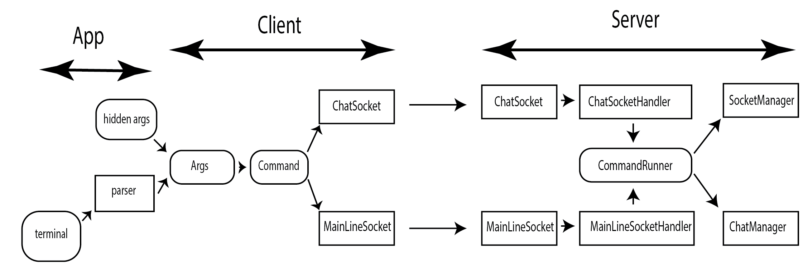

# Java socket server

## Project structure

#### App

App takes terminal line, coverts it to arguments and command name, then combines them if hidden args (for example username, most recent chat's port).
After that creates command from command name and arguments and sends it to client

#### Client
Client takes a command, decides on Which socket (MainLineSocket or ChatSocket) to send it in json format, receiving a response from the server.

#### Server
When Server receives connection, it creates Handlers (ChatSocketHandler or MainLineSocketHandler), they are basically separated threads, which process requests in parallel.
When a request is received (request is a jsonString with information about a command), handler builds a command based on the request. After that command is sent to commandRunner, provided with SocketManager and ChatManager.
After successful execution command returns a MainResponse, which is then propagated to the client.

#### Ports

MainLine port is set by default to 7777 (in Clint and Server config). After every chat is created Server initializes a new ChatSocket with a port provided in previous command.
During the starting sequence, client receives information about all chatSockets available, which is then shown to user to choose between.

## MainResponse Class

MainResponse Class consists of 4 field:
- Response code - Integer (See ExceptionCode Enum)
- Info - String (Information that will be presented to user)
- Data - JsonString (JsonString with information from command Execution)
- CommandName - String (name of command that was executed)

